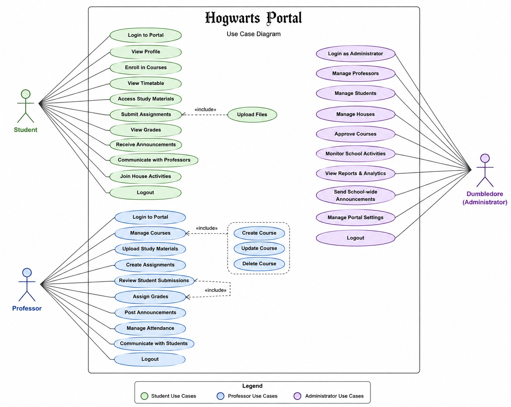

# Presentation

## What is Use Case ?

- A Use Case is a description of how a user interacts with a system to achieve a specific goal.

- It explains:
  `Who uses the system and what they want to do`

## Requirements

- Requirements are the needs, features, constraints, and expectations for a software system.

`They are generally divided into:`

1. Functional Requirements
- What the system should do.

`Student`
   - Students can securely log in.
   - Students can submit assignments before deadlines.
   - Students can access course materials anytime.

`Professor`
   - Professors can manage academic content.
   - Professors can evaluate and grade students.
   - Professors can communicate with enrolled students.

`    Dumbledore`
   - Admin can manage all portal users.
   - Admin can oversee academic operations.
   - Admin can configure system settings.

2. Non-Functional Requirements.

- How the system should perform

    - Secure authentication
    - Role-based access control
    - Responsive UI
    - Fast performance
    - Data privacy and integrity
    - High availability